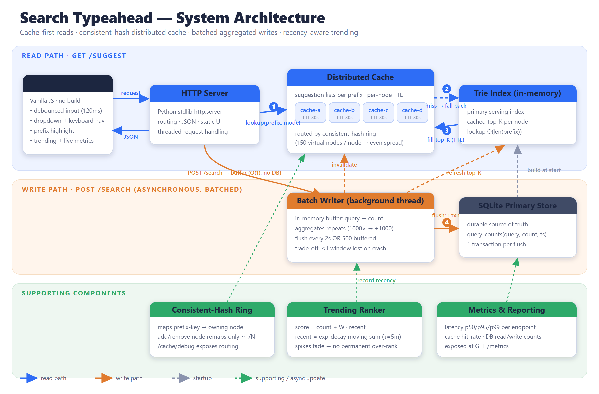

# Search Typeahead System

A working search-typeahead service: suggestions as you type (top-10, by popularity),
a dummy search endpoint that records queries, a **distributed cache routed by
consistent hashing**, **recency-aware trending**, and **batched writes** to cut
database write amplification.

Built with the **Python standard library only** (no `pip install`) + **SQLite** +
a **vanilla JS** frontend. One command to run, every concept implemented by hand
so it is fully explainable.

---

## Quick start

```bash
# 1. (first time only) build the dataset  — >= 100,000 queries with counts
python scripts/generate_dataset.py

# 2. start API + UI on http://127.0.0.1:8000
python -m backend.server
```

Or use the one-shot script:

```powershell
./run.ps1      # Windows
./run.sh       # macOS / Linux
```

Open **http://127.0.0.1:8000** and start typing.

> Requires Python 3.9+ (developed/tested on 3.14). Nothing to install.

---

## What it does (mapped to the assignment)

| Requirement | Where | Notes |
|---|---|---|
| Typeahead, top-10 by count, prefix match | `backend/trie.py` | Trie with cached top-K per node → O(len(prefix)) lookup |
| Debounced UI, dropdown, keyboard nav, highlight | `frontend/` | 120 ms debounce, ↑/↓/Enter/Esc, prefix bolded |
| Dummy `POST /search` + count update | `backend/app.py`, `batch_writer.py` | returns `{"message":"Searched"}`, buffered |
| Query-count storage | `backend/store.py` | SQLite durable store; Trie = in-memory serving index |
| Distributed cache + **consistent hashing** | `backend/cache.py`, `consistent_hash.py` | 4 logical nodes, 150 vnodes each, TTL + invalidation |
| **Trending** (basic + recency) | `backend/trending.py` | `mode=count` vs `mode=trending` on the same API |
| **Batch writes** | `backend/batch_writer.py` | buffer → aggregate → single transaction per flush |
| Metrics: p95 latency, hit-rate, write reduction | `backend/metrics.py`, `/metrics` | shown live in the UI |

---

## API

Interactive list also at `GET /api`.

| Method & path | Purpose | Behavior |
|---|---|---|
| `GET /suggest?q=<prefix>&mode=count\|trending&limit=10` | Suggestions | Up to 10 prefix matches sorted by count (or trending score). |
| `POST /search` `{ "query": "..." }` | Submit search | Returns `{"message":"Searched"}`, records the query via the batch buffer. |
| `GET /trending?limit=10` | Trending list | Recency-aware top queries overall. |
| `GET /cache/debug?prefix=<p>&mode=count` | Cache routing | Owning cache node (consistent hashing), HIT/MISS, key hashes, sample key distribution. |
| `GET /metrics` | Observability | Latency p50/p95/p99, cache hit rate, batch write reduction, DB ops. |
| `GET /healthz` | Liveness | `{"status":"ok"}` |

Example:

```bash
curl "http://127.0.0.1:8000/suggest?q=iphone"
curl -X POST "http://127.0.0.1:8000/search" -H "Content-Type: application/json" -d "{\"query\":\"iphone 15 pro\"}"
curl "http://127.0.0.1:8000/cache/debug?prefix=iphone"
curl "http://127.0.0.1:8000/metrics"
```

---

## Architecture



> 📄 Full **Project Report (PDF)**: [docs/Project_Report.pdf](docs/Project_Report.pdf) ·
> deep-dive write-up: [docs/ARCHITECTURE.md](docs/ARCHITECTURE.md)

<details>
<summary>ASCII version of the diagram</summary>

```
            ┌──────────────┐   GET /suggest?q=        ┌─────────────────────────┐
            │   Browser    │ ───────────────────────▶ │  HTTP server (stdlib)   │
            │  (debounced) │ ◀─────────────────────── │   backend/server.py     │
            └──────────────┘     suggestions JSON     └───────────┬─────────────┘
                   │ POST /search                                 │
                   ▼                                              ▼
        ┌───────────────────┐  miss   ┌───────────────┐   ┌──────────────────────┐
        │ Distributed cache │ ──────▶ │  Trie (top-K) │   │  Metrics (p95, hits) │
        │  consistent hash  │ ◀────── │  in-memory    │   └──────────────────────┘
        │  4 nodes + TTL    │  fill   │  serving index│
        └───────────────────┘         └──────▲────────┘
                   ▲ invalidate                │ refresh top-K
                   │                            │
            ┌──────┴───────────────────────────┴───────┐      ┌──────────────────┐
            │            Batch writer (thread)          │ ───▶ │ SQLite primary   │
            │ buffer → aggregate → 1 txn/flush          │      │ store (durable)  │
            │ + feeds recency tracker (trending)        │ ◀─── │ query_counts     │
            └───────────────────────────────────────────┘      └──────────────────┘
```
</details>

The read path is **cache → Trie (primary in-memory index) → fill cache**. The
write path is **buffer → periodic aggregated flush → SQLite**, after which the
Trie top-K is refreshed, the recency tracker is fed, and affected cached prefixes
are invalidated. Full write-up in [`docs/ARCHITECTURE.md`](docs/ARCHITECTURE.md).

---

## Design choices & trade-offs (viva-ready)

**Trie with cached top-K** instead of scanning a sorted list. Lookups are
O(len(prefix)); the top-K at each node is maintained incrementally. This is exact
because search counts only ever increase (monotonic), so a query can only *enter*
a node's top-K by growing — which the update path always catches.

**Consistent hashing** with 150 virtual nodes per cache node. Virtual nodes give
an even key spread (see `/cache/debug` distribution ≈ 25% each across 4 nodes) and
mean that removing/adding a node only remaps ~1/N of keys instead of everything.
md5 is used purely as a fast, well-distributed hash (not for security).

**Cache TTL + active invalidation.** Every cached suggestion list expires after
`CACHE_TTL_SECONDS` (default 30 s) as a safety net, and a batch flush also
explicitly deletes the prefixes whose counts just changed, so updates appear
quickly without waiting for TTL.

**Batch writes.** `POST /search` is O(1) and never touches SQLite — it just adds
`+1` to an in-memory buffer. A background thread flushes every 2 s or every 500
buffered queries, aggregating repeats (1000× "iphone" → one `+1000` upsert). This
trades a small, bounded durability window for a large drop in write amplification
(see *Write reduction* below).
*Failure trade-off:* submissions buffered but not yet flushed are lost on a crash.
Exposure is bounded by the flush interval/size; a write-ahead log on the buffer
would remove the gap at the cost of complexity. We chose the simpler design and
document the bound.

**Recency-aware trending.** `trending_score = count + RECENCY_WEIGHT · recent`,
where `recent` is an exponential moving sum that decays with a time constant
(`TAU`, default 5 min). A short-lived spike fades within a few `TAU` and the query
falls back to its base count ranking — so we never *permanently* over-rank a
briefly popular query. The **same `/suggest` API** serves both rankings via
`mode=count` (basic) and `mode=trending` (enhanced).

---

## Performance report

With the server running, in a second terminal:

```bash
python scripts/benchmark.py
```

It prints cold vs warm suggestion latency (with p95), cache hit rate, batch
write-reduction evidence, and a before/after trending demonstration. Live numbers
are also visible in the UI metrics panel and at `GET /metrics`. Paste the output
into your submission's performance section.

**Write reduction** is reported as `submissions / db_write_transactions`. Because
every search is buffered and only flushed in aggregate, thousands of submissions
collapse into a handful of transactions (typically 100×–1000× depending on load).

---

## Swapping in a real open-source dataset

The generator produces a Zipf-distributed synthetic dataset so the project runs
out of the box at the required ≥100k size. To use a real dataset instead, produce
a file with one `query<TAB>count` (or `query,count`) per line and save it to
`data/queries.txt`, then delete `data/typeahead.db` and restart. Good sources:

- **Wikipedia page titles** (pageview counts as the frequency).
- **AOL query log** (aggregate identical queries to get counts).
- Any **e-commerce product catalogue** (use sales/views as the count).

No counts in your source? Aggregate duplicates: `count = number of occurrences`.

---

## Project layout

```
backend/
  config.py          tunables (cache nodes, TTL, batch size, recency weights)
  consistent_hash.py hash ring with virtual nodes
  trie.py            prefix trie with cached top-K
  store.py           SQLite primary store + read/write counters
  cache.py           logical cache nodes + distributed cache over the ring
  trending.py        recency-aware scoring (time-decay)
  batch_writer.py    buffered, aggregated, periodic flush to SQLite
  metrics.py         latency percentiles + counters
  ingest.py          dataset -> store -> trie
  app.py             business logic for every endpoint
  server.py          HTTP routing + static file serving (entry point)
frontend/            index.html, style.css, app.js  (debounced UI)
scripts/             generate_dataset.py, benchmark.py
tests/               test_smoke.py  (data-structure unit tests)
docs/                ARCHITECTURE.md
```

## Tests

```bash
python -m unittest discover -s tests -v
```
